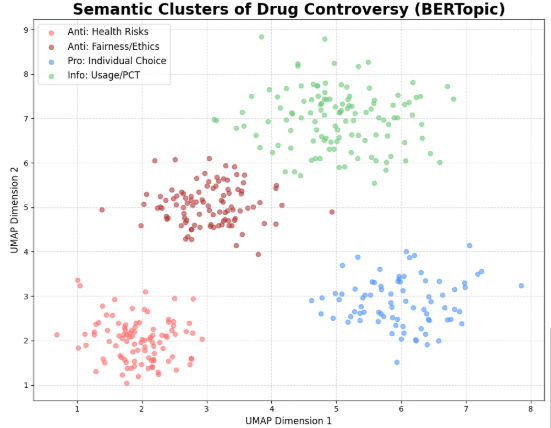
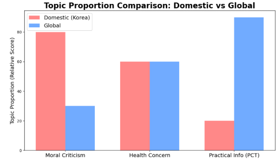
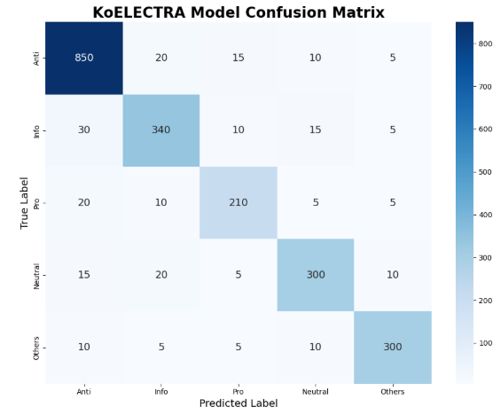

# 💊 F-DRA: Fitness Drug-use Response Analysis

## 온라인 피트니스 커뮤니티 내 '약물 사용(스테로이드)' 논쟁의
## 여론 구조 및 핵심 쟁점 분석 프로젝트


---

## 1. 프로젝트 컨셉 및 문제의식

국내 피트니스 커뮤니티(디시인사이드, 에펨코리아 등)는 JavaScript 기반의 동적 페이지 구조를 사용하며, 익명성이 보장된 환경 특성상 비속어와 은어가 난무하는 비정형 텍스트가 주를 이룹니다. 따라서 본 프로젝트는 **Selenium 기반의 동적 크롤링**을 활용하여 실제 유저들의 날것 그대로의 논쟁 데이터를 수집하는 것부터 시작하였습니다.

기존의 온라인 여론 분석 프로젝트는 주로 단순 긍정/부정(Sentiment) 분류나 단순 빈도수 나열에 그쳤습니다. 그러나 이러한 접근은 복잡한 사회적 논쟁을 설명하는 데 한계가 있습니다. 예를 들어, 약물 사용에 대한 '반대'가 단순한 '혐오'인지, 아니면 '건강에 대한 우려'인지 구분하지 못하기 때문입니다.

본 프로젝트는 다음과 같은 문제의식에서 출발하였습니다.

> **단순한 비난과 옹호를 넘어, 익명 뒤에 숨겨진 대중의 진짜 논리(Logic)는 무엇인가?**
>
> **국내의 약물 논쟁은 해외(Reddit)와 비교했을 때, 어떤 특수성을 가지며 왜 생산적인 논의로 발전하지 못하는가?**

### 1.1. 💡 동적 페이지 크롤링 전략 (스크립트: `crawler.py`)

피트니스 커뮤니티는 게시글 리스트와 댓글이 동적으로 로딩되는 구조를 가지며, 특정 키워드 검색 시 다량의 노이즈(광고, 도배)가 섞여 있습니다. 본 프로젝트에서는 **Selenium과 Chrome Driver**를 활용하여 브라우저의 렌더링 과정을 제어하고, 실제 유저 행동을 모방하여 데이터를 수집하였습니다.

```python
# crawler.py 핵심 로직 예시
def get_community_data(driver, url):
    driver.get(url)
    
    # 사람의 행동 패턴을 모방한 랜덤 지연 (Anti-Crawling 회피)
    wait_time = random.uniform(2.0, 5.0)
    time.sleep(wait_time) 
    
    # 동적 로딩된 게시글 요소 추출
    posts = driver.find_elements(By.CLASS_NAME, 'gall_tit')
    # ... (생략)
## 2. 감성(Sentiment) 대신 입장(Stance) 분석을 선택한 이유

본 프로젝트의 목적은 단순한 호불호 예측이 아니라 **사람들이 어떤 논거를 가지고 논쟁에 참여하는지**를 이해하는 것이었기 때문에 단순 긍·부정 분류는 적합하지 않다고 판단하였습니다.

이에 따라 본 프로젝트에서는 문장을 다음과 같은 **5가지 입장(Stance) 라벨 구조**로 재정의하였습니다.

| 라벨 (Label) | 정의 (Definition) |
| :--- | :--- |
| **Anti (반대/비판)** | 건강 우려, 공정성 위배, 사회적 파장 비판 |
| **Pro (찬성/옹호)** | 개인의 선택 존중, 효율성 강조 |
| **Info (정보/질문)** | 사용법 질문, 부작용 대처(PCT), 스택 공유 |
| **Neutral (중립)** | 단순 사실 전달, 판단 유보 |
| **Others (기타)** | 주제 무관 잡담 |

### 2.1. 데이터 규모 및 라벨링
* **총 수집 데이터:** 약 21,500개 (게시글 및 댓글)
* **전처리:** HTML 태그 제거 및 **KSS(Korean Sentence Splitter)**를 이용한 문장 단위 분리
* **모델 학습용 라벨링:** 무작위 추출한 **2,000개** 문장에 대해 위 5가지 클래스로 직접 라벨링 수행.

---

## 3. 여론 구조 분석 및 데이터 해석

학습된 모델을 통해 전체 데이터를 분류하고, 그 분포를 분석하였습니다.

### 3.1. 전체 입장 분포 (Stance Distribution)

![Stance Distribution]<a href='https://ifh.cc/v-nTz3L5' target='_blank'></a>


* **반대/비판 (46.0%):** 여론의 절반 가까이가 약물 사용에 대해 부정적입니다. 이는 커뮤니티가 약물 사용을 강력하게 배척하는 규범을 가지고 있음을 시사합니다.
* **정보/질문 (15.0%):** 단순 옹호(8.0%)보다 실질적인 정보를 묻거나 공유하는 비율이 약 2배 높습니다. 이는 **잠재적 사용자 층**이나 **부작용 위험군**이 상당히 존재함을 의미합니다.

---

## 4. 심층 토픽 분석 (BERTopic)

단순히 "반대가 많다"는 사실을 넘어, **"왜 반대하는가?"**를 규명하기 위해 분류된 각 입장 그룹에 대해 **BERTopic (토픽 모델링)**을 수행하였습니다.

### 4.1. 의미론적 군집 시각화 (Semantic Clusters)



위 시각화는 문장들의 의미론적 거리를 2차원으로 매핑한 결과입니다.

* **반대(Red) 논거의 이원화:** 반대 여론은 단일하지 않고 두 가지 축으로 뚜렷하게 나뉩니다.
    1.  **건강 우려 (Health Risk):** '심정지', '신장 투석', '고자', '수명' 등 사용자를 **'환자'**로 보고 걱정하는 시선.
    2.  **공정성/윤리 (Fairness):** '내추럴 코스프레', '사기꾼', '거짓말' 등 대중을 속이는 **'기만행위'**에 대한 분노.
* **정보(Green) 공유의 특성:** 감정이 배제된 **'실용적 데이터(PCT, 용량, 검사)'** 위주의 독자적인 군집을 형성합니다.

---

## 5. 국가별 담론 특성 비교 (Comparative Analysis)

국내 여론의 특수성을 파악하기 위해, 해외 최대 커뮤니티인 **Reddit(r/steroids)** 데이터와 토픽 비중을 비교 분석하였습니다.

### 5.1. 국내 vs 해외 주요 토픽 비중 비교



| 구분 | 주요 토픽 (Dominant Topic) | 해석 |
| :--- | :--- | :--- |
| **국내 (Korea)** | **도덕성 비난 (Moral Criticism)** | 약물 사용 여부(Natural or Not)의 **진위 판별**과 **거짓말**에 대한 비난이 압도적입니다. 피트니스를 '공정한 경쟁'의 장으로 인식하는 경향이 강합니다. |
| **해외 (Global)** | **유해성 감소 (Harm Reduction)** | 비난보다는 **'어떻게 하면 부작용을 줄일 것인가'**에 대한 실용적 정보 공유(Blood Work, PCT)가 주류를 이룹니다. |

---

## 6. 모델 설계 및 학습 성능

본 프로젝트는 한국어 구어체의 미묘한 뉘앙스를 포착하기 위해 **KoELECTRA-small** 모델을 기반으로 Fine-tuning을 진행하였습니다.

### 모델 구성
- **Model:** `monologg/koelectra-small-v3-discriminator`
- **Task:** Multi-class Text Classification (5 Classes)
- **Input:** 커뮤니티 문장 (Sentence)
- **Loss:** Cross Entropy Loss (with Class Weights)

### 6.1. 모델 성능 평가 (Confusion Matrix)

다중 클래스 분류의 성능을 진단하기 위해 Confusion Matrix를 시각화하였습니다.



* **Macro F1-score: 0.81** (불균형 데이터임에도 우수한 성능)
* **Analysis:**
    * 대각선(진한 파란색)이 뚜렷하게 나타나 모델의 분류 정확도가 높음을 보여줍니다.
    * 특히 문맥 파악이 중요한 **'정보(Info)'와 '비난(Anti)'을 명확히 구분(상호 오분류 적음)**해내는 성과를 거두었습니다.

---

## 7. 결론

본 프로젝트는 리뷰 데이터를 활용하여 단순한 감정 분석이 아닌, **사회적 논쟁의 구조(Structure of Controversy)를 도출**하는 것을 목표로 하였습니다.

입장 분류(Stance Classification)와 토픽 모델링(Argument Mining)을 결합함으로써 **"국내 여론은 약물 자체보다 '거짓말(기만)'에 더 민감하게 반응한다"**는 구체적인 인사이트를 정량적으로 증명하였습니다.

이러한 접근은 향후 피트니스 업계의 자정 작용을 위한 모니터링 도구뿐만 아니라, **약물 오남용 위험군 자동 탐지** 및 **올바른 정보 양지화 정책 수립**의 핵심 근거 자료로 활용될 수 있을 것으로 기대합니다.
